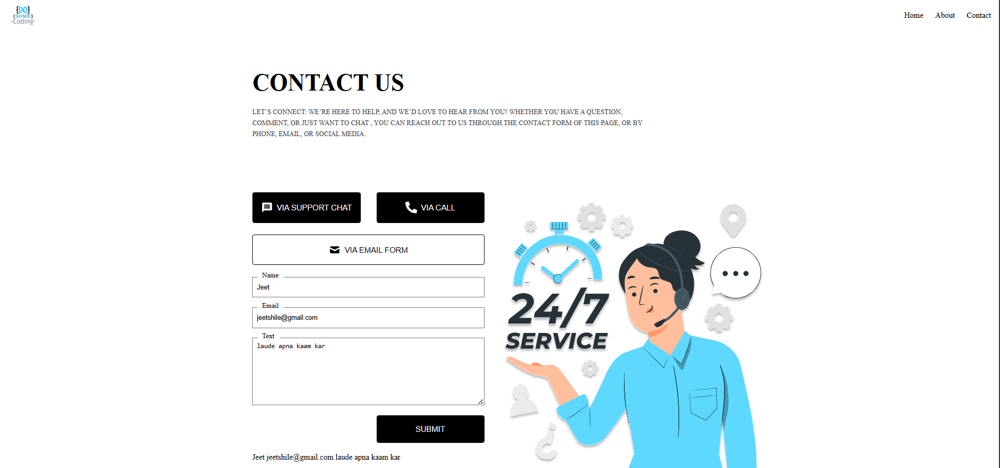

📞 Contact Us Page (React + Vite)

A modern and clean Contact Us Page built using React + Vite as part of my frontend learning journey.

📸 Screenshot

✨ Features
.Responsive design
.Contact form (Name, Email, Message)
.Support Chat button
.Call button
.Email form trigger
.Simple & clean UI
.Built using React + Vite

🛠️ Tech Stack
.React
.Vite
.JavaScript (ES6+)
.CSS
.NPM

📁 Folder Structure
Contact_us_page/
│── public/
│   └── Screenshot/
│       └── screenshot.png
│── src/
│   ├── components/
│   ├── App.jsx
│   ├── main.jsx
│── index.html
│── package.json
│── vite.config.js
│── README.md

⚙️ Installation & Setup

1. Clone this repository
git clone <your-react-projects-repo>

2. Go to the project folder
cd react_projects/Contact_us_page

3. Install dependencies
npm install

4. Start dev server
npm run dev

🙏 Credits

Special thanks to Anshu Raj (anshuopinion)
for his helpful React tutorials.

GitHub: https://github.com/anshuopinion

Website: https://www.dosomecoding.com

Instagram: @dosomecoding

LinkedIn: https://linkedin.com/in/anshuopinion

👨‍💻 Author
Jeet Shile

📄 License
This project is for learning and practice only.
